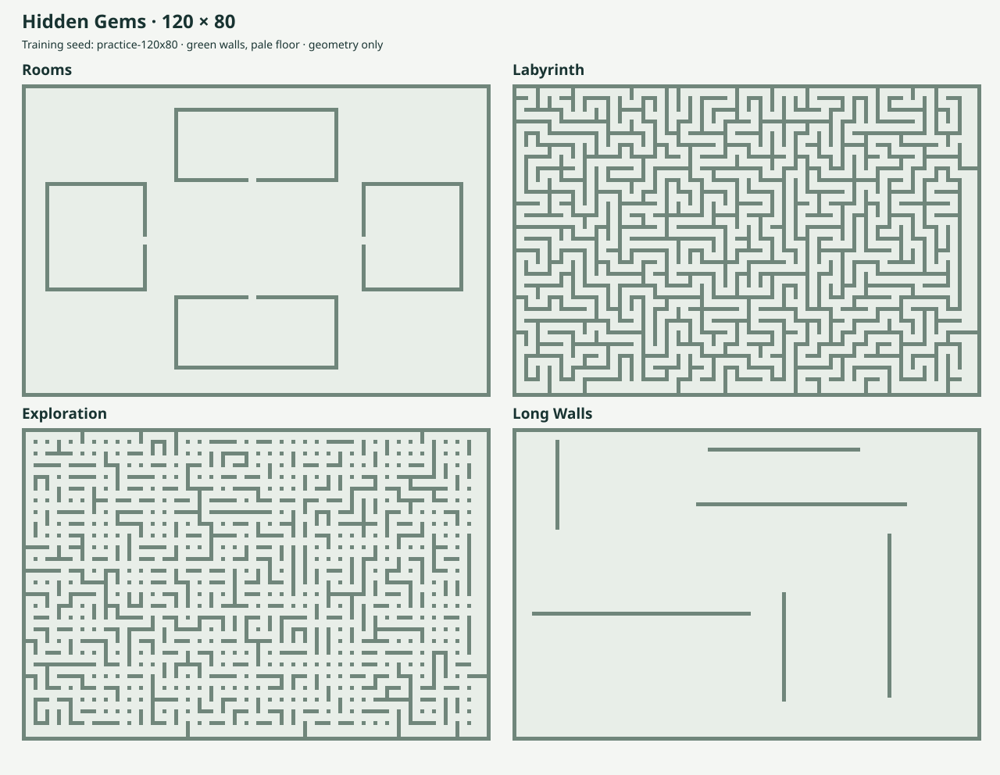

# Hidden Gems: Current Rules

16 September 2026 · Mechanics adopted by the user

This record supersedes the movement, geometry, sensing, map-pool and gem-generation
choices in the earlier version-1.1 design documents. It is the authoritative rules document for this server. Earlier experiments
used smaller maps and 50 bots; their measured results are historical evidence,
not new balance measurements at 120 × 80 or 64 bots.

## Arena and movement

- A match supports 1–64 bots (default 50), all with solid bodies.
- Corridors, corners, junctions and doorways permit a width of at least two
  cells. Walls need only be one cell thick. One blocked cell can be bypassed
  when the remaining cells are free; multiple bots can still block passage.
- A move follows one cardinal direction for integer distance d and costs d².
  It cannot turn, jump walls or pass through bots. There is no arbitrary distance
  limit beyond affordability and terrain.
- Every intervening cell is checked. A blocked burst stops without refund.
  The j-th cell of a length-d burst is reached at j/d of the turn; exact arrival
  order and seeded rotating priority settle conflicts. Swaps are blocked.

## Map pool

The competition uses four map families, each **120 × 80 cells**, including its
one-cell outer boundary. “Rooms” is the existing Four Buildings layout.

| Map | Layout | Main decisions |
|---|---|---|
| **Rooms** | An open center with one hollow rectangular building on each side. Each room has one inward-facing, two-cell-wide doorway. | Enter a room or stay outside; choose approaches to doors and competing targets. |
| **Labyrinth** | A dense, connected maze with two-wide corridors, many turns and dead ends. Wall strips are one cell thick. | Remember explored routes, locate connections and estimate the real travel distance. |
| **Exploration** | A more open, connected maze with many additional links and alternative routes. | Choose where to explore, when to scan and when a detour is worthwhile. |
| **Long Walls** | Mostly open floor interrupted by a few long, separate straight walls. Both ends of every wall can be passed. | Choose which end to go around and when a long straight burst is worth its energy. |

The current Long Walls generator places six one-cell-thick segments: three
horizontal walls of 36–63 cells and three vertical walls of 22–42 cells. Each
segment has at least two clear floor cells between it and any other wall,
including the outer boundary. The segments do not intersect or form enclosed
rooms. Positions and lengths vary with the map seed.

Labyrinth and Exploration use rooms at least 2 × 2 connected through openings
at least two cells wide. Labyrinth initially connects the rooms as a maze tree.
Exploration uses the same construction and independently opens each remaining
neighbor connection with probability 50%, creating more loops and route choices.
Rooms currently uses a fixed reference architecture; its seeds vary bot starts
and gems. Labyrinth, Exploration and Long Walls also vary their geometry.

Every generated map must satisfy these conditions:

- All floor cells are connected, with at least 64 distinct starting cells.
- Corridors, corners, junctions and doors allow passage at least two cells wide.
  The generator checks that every floor cell belongs to an open 2 × 2 square
  and that removing any one floor cell leaves the remaining floor connected.
- Walls may be one cell thick. Long Walls additionally preserves clear space
  around the ends of each segment.
- Bots start simultaneously on distinct floor cells, one per configured bot selected by a seeded
  shuffle. Room interiors and dead ends are eligible; equally favorable starts
  are not guaranteed.

All four families use the same movement, energy, sensing and gem-generation
parameters. Use equal numbers of rounds from each family: for the existing
12-round competition format, that means three rounds per family. The earlier
Chaos profile is outside this four-family pool.

## Energy and sensing

- Start with zero energy. Add three before each turn's decisions.
- Storage has no maximum capacity. Remaining energy has no scoring value.
- World sensing is paid. Integer n ≥ 1 gives a Manhattan scan radius of 5n at
  cost ceil(n^1.5). Costs for radii 5, 10, 15, 20 and 40 are 1, 3, 6, 8 and 23.
- A bot selects a scan, receives its result, then selects movement in the same
  turn. Both costs use the same reserve. Skipping the scan costs zero.
- Gems inside scan range are detected through walls, with exact position and
  remaining lifetime. Terrain and opponents require line of sight.
- Own position and movement feedback remain free. Feedback includes actual
  distance and whether movement stopped early. Traversed cells become known
  floor. An unseen obstruction's type is not disclosed.
- Bots own their persistent terrain and gem memory. Skipping a scan supplies no
  new radar or line-of-sight observation; own movement feedback remains free.
  A previously observed gem may have been collected by another bot; its known
  expiry remains reliable.

## Gem generation and scoring

### Match clock and spawn frequency

A match contains **1,500 turns, numbered 0–1,499**. The map initially contains
no gems. Turns 0–9 form a ten-turn opening period with no gem spawns.

One candidate spawn is scheduled on turns **10, 13, 16, …, 1,498**: one attempt
every three turns, for **497 attempts per match**. This is an attempt rate;
fewer than 497 gems may actually appear. There is no automatic replacement
immediately after a collection and no catch-up burst after a skipped attempt.

### Where a gem may appear

Before play, the seeded generator chooses a candidate floor cell for each
scheduled attempt. It draws from the full list of floor cells without deliberate
spatial weighting, with replacement: the same cell can be chosen again later.

- Every floor cell is eligible, including room interiors, doorways, corridors,
  dead ends and the open center. Walls and the outer boundary are ineligible.
- There are no special spawn zones, hotspots, per-room quotas or minimum
  distances from bots or other gems.
- The candidate is chosen independently of the bots' decisions. Occupancy is
  checked when that candidate's scheduled turn arrives.
- Larger floor regions receive more candidate spawns in proportion to their
  number of floor cells. Individual rooms are not guaranteed an equal share.

Historical simulators used seeded pseudorandom floor-index draws. This server
uses rejection sampling from private HMAC-SHA256 random streams, avoiding modulo
bias. Neither implementation adapts candidate locations to scores or bot behavior.

### Lifetime assignment

Each candidate also receives one of three lifetimes before the match:

| Lifetime | Candidates in a full 1,500-turn schedule | Initial points if collected on its birth turn |
|---|---:|---:|
| 60 turns | 166 | 60 |
| 180 turns | 165 | 180 |
| 300 turns | 166 | 300 |

The 497 lifetime labels are shuffled with a separate seeded random stream and
assigned to the candidate attempts. Their order is unpredictable to entrants;
it does not repeat as a public short/medium/long cycle. The mean candidate
lifetime is exactly 180 turns. The counts describe scheduled candidates,
not guaranteed successful spawns or the mix active at any one time.

A skipped attempt consumes its assigned lifetime and position. Neither is
reused to replace a later candidate. Lifetime assignment is separate from the
random streams for map construction, starts, candidate positions and initiative.

### When an attempt succeeds

At the beginning of turn t, first remove all gems whose expiry is at or before
t. Then evaluate that turn's scheduled candidate, if there is one. Apply these
checks in order:

1. If **20 gems are already active**, skip the attempt.
2. If a bot occupies the candidate cell, skip the attempt.
3. If another active gem occupies the candidate cell, skip the attempt.
4. Otherwise, create the gem at that cell with birth turn t and its assigned
   lifetime L. Its expiry turn is t + L.

Skipped attempts are never retried, relocated or delayed. A bot leaving the
cell later that turn does not rescue a skipped attempt. A collection later that
turn does not free a slot for an attempt already skipped because of the cap.
Expiry at the start of the turn does free a slot before the cap is checked.

Each gem has a unique ID derived from its scheduled attempt number. Skipped
attempts leave gaps in IDs. A cell may host a new gem after its previous gem
has been collected or expired, provided the new candidate passes all checks.

### Lifetime, collection and points

For a gem born on turn b with lifetime L, its remaining lifetime on turn t is
**b + L − t**. It is active on turns b through b + L − 1. At the start of turn
b + L it disappears before sensing and movement, and is worth no points.

Collection is automatic on entering the gem's cell, including an intermediate
cell of a longer move. The gem is removed immediately, and its collector earns
points equal to its remaining lifetime. At most one bot receives those points.
Arrival order and the movement priority rule resolve competing arrivals.
Lifetime is measured in whole turns; fractional arrival times within one turn
do not further reduce the score.

For example, a 60-turn gem born on turn 10 awards 60 points on turn 10,
20 points on turn 50 and one point on turn 69. It expires before actions on
turn 70. A bot making a longer move can collect several distinct gems along
its traversed path, paying the declared movement cost once.

Uncollected gems award no points when the match ends. A late gem can have
positive remaining lifetime at the end; the match is not extended to let it
expire. All candidate lifetimes sum to 89,460 points before skipped spawns and
decay, so this is an upper bound on the gross gem points available in a match.

### Information available to bots and replay

Bots learn a detected gem's ID, exact coordinate and current remaining lifetime
through paid gem radar only. There are no global gem announcements. A detected
gem's own coordinate logically implies floor; it reveals no route, neighboring
terrain or opponents. Other bots' collections are not globally announced.

The server keeps the random seeds, future candidate positions and future
lifetime order private during competition. It records every attempt, its
position and assigned lifetime, the outcome or skip reason, expiry events and
collections for replay and later auditing. Identical inputs and actions must
produce identical results. Reusing a candidate schedule does not guarantee the
same successful spawns when bots act differently, because occupancy and the
active-gem cap can change.

## Excluded mechanics

Collected points cannot be exchanged for energy. Gem births and collections are
not broadcast to all bots. Earlier tests of those ideas remain in the history
and evidence folders, but neither feature is part of the current game.

Directional search rays, energy pills, pass-through movement, free world sensing
and elimination are also outside this ruleset. Their earlier proposals and
experiments remain in the historical record.
